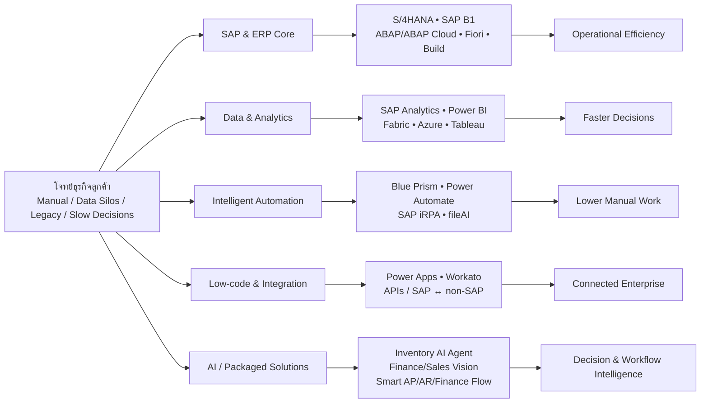
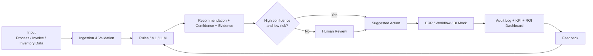
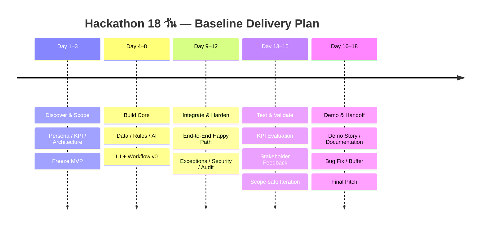

# Deep Research: บริษัท ZyGen — ธุรกิจ เทคโนโลยี ผลงาน ตลาด และแนวคิด Hackathon ระยะ 18 วัน

## Executive summary

**ZyGen Company Limited เป็นบริษัทที่ปรึกษาและผู้ให้บริการด้านเทคโนโลยีของไทยที่มีรากฐานจาก SAP** โดยเว็บไซต์บริษัทระบุว่าก่อตั้งในปี 2542/1999 เริ่มจากงาน SAP Professional Consulting ก่อนขยายจาก ERP ไปสู่ Data & Analytics, Business Intelligence, Intelligent Automation/RPA, AI, Low-code/No-code, Enterprise Integration และ Virtual Platforms ปัจจุบันหน้าเว็บไซต์จัดพอร์ตหลักเป็น SAP Services, Data & Analytics/BI, Intelligent Automation และโซลูชันธุรกิจแบบพร้อมใช้งาน เช่น Sales Vision, Inventory AI Agent, Finance Vision, Smart AP/AR/Sales/Procurement/Finance Flow และ SAP Digital Warehouse. citeturn16search19turn16search9turn17search9

ในเชิงโมเดลธุรกิจ ZyGen ไม่ใช่ “บริษัททำซอฟต์แวร์ผลิตภัณฑ์เดียว” แต่มีลักษณะเป็น **Technology Consulting + System Integrator + Solution Provider** ที่นำแพลตฟอร์มของผู้ผลิตระดับโลกมาประกอบเป็นโซลูชันให้เข้ากับกระบวนการขององค์กรไทย ได้แก่ SAP, Microsoft, SS&C Blue Prism, Workato, fileAI, Gather และแพลตฟอร์มอื่น ๆ พร้อมบริการตั้งแต่ assessment, business/process consulting, implementation, integration, customization, license, training ไปจนถึง maintenance/support. จุดที่เห็นชัดจาก Power Platform คือ ZyGen เสนอทั้ง license optimization, strategy, implementation, AI integration, training และการเชื่อม SAP/ERP แบบ end-to-end. citeturn16search2turn17search3

**กลุ่มลูกค้าหลักแบ่งได้เป็นสามชั้น**: องค์กรขนาดใหญ่ที่มี SAP/ระบบ legacy และต้องการ transformation หรือ integration; บริษัทขนาดกลางและ SME ที่ SAP Business One เหมาะกับแกน ERP; และหน่วยธุรกิจอย่าง Finance, Accounting, Procurement, Operations, Supply Chain, QC, IT และ Sales ที่ต้องการแก้ workflow เฉพาะจุดด้วย RPA, Power Platform, BI หรือ AI. เว็บไซต์ Careers ระบุประสบการณ์ใน Banking/Financial Services, Manufacturing, Petroleum/Energy, Telecommunications, Internet, Healthcare และ Government ขณะที่ผลงานสาธารณะเพิ่มตัวอย่าง Retail, Automotive, FMCG/Food & Beverage และ Education. citeturn15search12turn18search4turn18search5turn18search3

จุดแข็งที่โดดเด่นคือ **ความรู้ SAP ผสมกับความสามารถข้ามแพลตฟอร์ม** ซึ่งสำคัญต่อองค์กรที่ข้อมูลและ workflow กระจายอยู่ทั้ง SAP และ non-SAP ตัวอย่างปี 2026 คือโครงการกับ The Mall Group ด้าน Delta Load Optimization และ SAP CAR Data Integration เพื่อยกระดับ data processing และการเข้าถึง insight; Siam Aisin เปลี่ยน QC Request ที่เคยติดตามผ่านอีเมล/กระดาษเป็นระบบที่ติดตามสถานะได้ชัดขึ้น; GT-Next Tech ใช้ SAP Business One; และ ThaiBev ใช้ Virtual Space/Gather เพื่อรองรับ hybrid collaboration. citeturn18search4turn18search5turn18search10turn18search3 ด้าน automation มีหลักฐานจากผู้ผลิตแพลตฟอร์มโดยตรงว่า ZyGen ได้รางวัล APAC Regional Winner สองหมวดใน SS&C Blue Prism Partner Excellence Awards 2025 ได้แก่ Innovation และ Client Business Impact: Industries. citeturn22search1

**โอกาสเชิงตลาดที่สำคัญที่สุดในช่วง 2026–2030** คือคลื่น SAP modernization: SAP ระบุ mainstream maintenance ของ Business Suite 7 core applications ถึงสิ้นปี 2027 และมี optional extended maintenance ถึงสิ้นปี 2030 ขณะที่ S/4HANA มี innovation commitment ถึงปี 2040. citeturn19search0 ขณะเดียวกัน depa พบว่า 70% ของกลุ่มตัวอย่างภาคอุตสาหกรรมไทยในปี 2024 อยู่ที่ระดับ Industry 2.0 Solution ซึ่งสะท้อนว่าการเปลี่ยนจาก manual/Excel/email ไปเป็น workflow/data-driven operations ยังมีช่องว่างอีกมาก. citeturn19search1 กระแสถัดไปคือ Agentic AI และ AI Governance: Microsoft Work Trend Index 2026 ชี้ถึงการเปลี่ยนจาก AI ที่ช่วยตอบคำถามสู่ AI ที่เข้ามาร่วม execute งาน ส่วน ETDA กำลังผลักดัน practical AI-governance toolkits, impact assessment และ AI safety/red teaming ในไทย. citeturn19search3turn19search11turn19search14

**ข้อสรุปสำหรับ Hackathon:** ภายใต้ข้อจำกัดทีม 4 คน × 18 วัน และไม่มีธีม/งบ/skill ที่ระบุ โจทย์ที่เหมาะกับบริบท ZyGen ที่สุดไม่ควรพยายามสร้าง “ERP ใหม่” แต่ควรสร้าง **thin, demonstrable intelligence layer บน process/data ที่มีอยู่** โดยสามตัวเลือกเด่นที่สุดจากการประเมิน SPM/PMI ในรายงานนี้คือ **Automation Opportunity Scanner**, **Smart AP Lite** และ **Inventory AI Copilot** เพราะขอบเขตควบคุมได้ มี business KPI ชัด สาธิต end-to-end ได้ภายใน 18 วัน และเชื่อมตรงกับจุดแข็งของ ZyGen ด้าน process discovery, automation, document AI, ERP integration และ analytics/AI. การให้คะแนนอิงมิติ scope, schedule, cost/finance, quality, risk และ stakeholders โดยสอดคล้องกับ PMBOK ปัจจุบันที่เน้น governance, scope, schedule, finance, stakeholders, resources และ risk พร้อมหลัก “embed quality” และ “focus on value”. citeturn20search0

## ภาพรวมธุรกิจและตำแหน่งทางตลาด

**ข้อมูลพื้นฐาน.** ZyGen ระบุว่าก่อตั้งในปี 1999 และมีสำนักงานใหญ่ในกรุงเทพฯ โดยเริ่มจากการเป็นผู้เชี่ยวชาญ SAP Consulting. ข้อมูลนิติบุคคลสาธารณะที่รวบรวมจากข้อมูลภาครัฐระบุ บริษัท ไซเจ็น จำกัด เลขทะเบียน 0105543014651 จดทะเบียนวันที่ 10 กุมภาพันธ์ 2000 ทุนจดทะเบียน 5 ล้านบาท และยังดำเนินกิจการอยู่ จึงควรแยกความหมายระหว่าง “เริ่มก่อตั้ง/ดำเนินธุรกิจปี 1999” กับ “วันที่จดทะเบียนนิติบุคคลปี 2000”. citeturn16search19turn0search6

เว็บไซต์ปัจจุบันวาง positioning ว่าเป็นผู้ให้คำปรึกษาด้าน innovation/technology โดยเน้น SAP, Automation/RPA และ Data Analytics และมี partner ecosystem ซึ่งประกอบด้วย SAP, SS&C Blue Prism, Microsoft, fileAI, Workato, Gather และ ZEP. citeturn15search6turn17search9 หน้า LinkedIn สาธารณะจัด ZyGen อยู่ในอุตสาหกรรม IT Services and IT Consulting และใช้ช่วงขนาดบริษัท 51–200 คน; ตัวเลขบุคลากรบน social platform ควรมองเป็นเพียงข้อมูลประมาณการ เนื่องจากขึ้นอยู่กับการอัปเดตโปรไฟล์ของพนักงาน. citeturn18search8

**ข้อสังเกตเชิงกลยุทธ์:** จากโครงสร้างเว็บไซต์ล่าสุด ZyGen กำลังขยับจากโมเดล “ขาย man-day/implementation แยกเทคโนโลยี” ไปสู่ **solutionization** มากขึ้น กล่าวคือ package ความเชี่ยวชาญเป็น outcome ที่ผู้บริหารเข้าใจได้ เช่น Inventory AI Agent สำหรับเงินจม/stock-out, Finance Vision สำหรับ management reporting, Smart AP/AR Flow สำหรับการเงิน และ Ready-to-Deploy Application. นี่เป็นการอนุมานจากพอร์ตที่บริษัทเผยแพร่ ไม่ใช่คำประกาศกลยุทธ์อย่างเป็นทางการ. citeturn16search0turn21search1turn16search9turn16search5

แผนภาพนี้เป็นการจัดหมวดเชิงวิเคราะห์จากรายการบริการและ Business Solutions ที่ ZyGen เผยแพร่ในเว็บไซต์ปัจจุบัน. citeturn17search9turn16search9

**อุตสาหกรรมและ buyer personas ที่น่าจะเป็นตลาดหลัก**

| กลุ่ม | หลักฐาน/โจทย์ที่พบ | Buyer/ผู้ใช้งานที่เกี่ยวข้อง |
|---|---|---|
| Banking & Financial Services | ZyGen ระบุเป็น competency โดยตรง และพอร์ต RPA/Document Processing รองรับงานธุรกรรมจำนวนมาก. citeturn15search12turn21search8 | CIO, COO, Head of Operations, Finance, Compliance |
| Manufacturing / Automotive | เว็บไซต์ระบุ Manufacturing; Siam Aisin เป็นตัวอย่าง QC workflow. citeturn15search12turn18search5 | Plant/Operations, QC, Supply Chain, CIO |
| Energy / Petroleum | เป็น competency ที่บริษัทระบุ และหน้าแรกมี testimonial จาก PTT Digital Solutions. citeturn15search12turn17search3 | CIO, ERP/SAP Lead, Finance, Procurement |
| Retail / Consumer | The Mall Group ใช้ SAP data integration; Inventory/analytics เป็น use case ที่สัมพันธ์โดยตรง. citeturn18search4turn16search0 | CIO/CDO, Merchandising, Supply Chain, CFO |
| Telecom / Internet | ระบุเป็น competency ของบริษัท. citeturn15search12 | IT, Digital Operations, Finance |
| Healthcare | ระบุเป็น competency; document/automation stack รองรับ workflow เอกสารจำนวนมาก. citeturn15search12turn16search3 | CIO, Operations, Finance |
| Government | ระบุเป็น competency. citeturn15search12 | IT/Digital Transformation Office |
| SME / Mid-market | SAP Business One ถูกวางเป็น ERP สำหรับองค์กรขนาดเล็กและกลาง; GT-Next Tech เป็นกรณี implementation ที่เปิดเผย. citeturn18search6turn18search10 | Owner, CFO, IT Manager, Operations |
| Cross-industry functions | Power Platform/RPA/AI เน้นกระบวนการเฉพาะฝ่ายมากกว่าชนิดอุตสาหกรรม. citeturn16search2 | Finance, HR, QC, Procurement, Sales, Warehouse |

## พอร์ตผลิตภัณฑ์ เทคโนโลยี ลูกค้า และผลงาน

### ตารางเปรียบเทียบผลิตภัณฑ์และบริการหลัก

| กลุ่มบริการ | คุณสมบัติ/แพลตฟอร์มหลัก | ลูกค้าเป้าหมาย | มูลค่าทางธุรกิจ |
|---|---|---|---|
| **SAP ERP / S/4HANA** | Consulting, implementation, enhancement, support, SAP ERP, S/4HANA Cloud, Functional Consulting. citeturn17search9turn16search19 | Enterprise ที่ใช้ SAP/ต้อง migrate หรือ rollout | ทำ ERP เป็น single operational backbone, ลดความเสี่ยงระบบ legacy และเตรียมพร้อมก่อน maintenance horizon ของ Business Suite 7. citeturn19search0 |
| **SAP Development & Clean-Core Enablement** | ABAP, ABAP Cloud, Fiori, SAP Build, Pre-code Assessment, performance tuning; SAP Build เชื่อม SAP/non-SAP ผ่าน API ได้. citeturn16search24turn21search4 | SAP IT team ที่มี custom code จำนวนมาก | modernize custom development โดยพยายามลด technical debt และทำ extension ให้แยกจาก ERP core มากขึ้น |
| **SAP Business One** | ERP สำหรับ small/mid-size business, implementation, configuration, add-ons, support. GT-Next Tech เป็นลูกค้าที่เปิดเผย. citeturn18search6turn18search10 | SME / mid-market / subsidiary | รวม Finance, Sales, Purchasing, Inventory และ operations ในระบบเดียว |
| **Data & Analytics / BI** | SAP Analytics Cloud, Embedded Analytics, BPC, BW/4HANA, BusinessObjects, Azure Analytics, Fabric, Power BI, Tableau. citeturn17search9 | CFO/CDO/CIO, Finance, Sales, Operations | ลดเวลารวบรวมข้อมูล สร้าง management dashboards และเพิ่มความเร็วการตัดสินใจ |
| **Microsoft Power Platform** | Power BI, Power Apps, Power Automate, Power Pages, Copilot Studio; license, strategy, SAP/ERP integration, training, maintenance. citeturn16search2 | องค์กร Microsoft ecosystem และหน่วยงานที่ต้องการ low-code | digitize Excel/paper workflows เร็ว, citizen development, ลด backlog ฝั่ง IT |
| **Intelligent Automation / RPA** | SS&C Blue Prism, Power Automate, SAP iRPA, Ready-to-Deploy Processes. citeturn17search9 | Back-office ที่มี volume สูงและ rule-based work | ลด repetitive work, human error และ cycle time; ทำให้พนักงานย้ายไปทำงานวิเคราะห์มากขึ้น |
| **fileAI / Intelligent Document Processing** | ประมวลผล invoice, PO, claim, contract ฯลฯ; ZyGen ให้บริการ workflow design ถึง ERP integration. หน้า ZyGen ระบุ fileAI รองรับ 200+ ภาษาและ 100+ connectors ซึ่งเป็นตัวเลขจาก vendor/solution page. citeturn16search3turn21search8 | Finance/AP, Procurement, Insurance, Banking | ลด manual key-in และทำ document-to-workflow automation |
| **Workato / Enterprise Orchestration** | iPaaS/orchestration สำหรับ Apps, Agents, Data และ Workflow. citeturn16search12 | Enterprise ที่มี SaaS/ERP/API หลายระบบ | ลด point-to-point integration และเชื่อม automation/AI ให้ทำงานข้ามระบบ |
| **Analytics Solutions** | Sales Vision, Purchase Vision, Inventory AI Agent, Finance Vision. Inventory AI Agent เน้นค้นหา inventory problem, recommendation และ financial impact. citeturn16search9turn16search0 | Sales/Procurement/COO/CFO/Supply Chain | เปลี่ยน dashboard จากการ “ดูข้อมูล” ไปสู่การ “แนะนำการตัดสินใจ” |
| **Automation Solutions** | Smart AP, AR, Sales, Procurement, Finance Flow. citeturn16search9 | Shared Service, Finance, Procurement, Sales Ops | package workflow ที่พบซ้ำในหลายองค์กร ลดเวลาตั้งต้นโครงการ |
| **Virtual / Collaboration / Training** | Gather/Virtual Space, ZEP และหลักสูตร Power BI, Power Apps, Blue Prism, Power Automate, ABAP, SAP B1. citeturn21search3turn17search6 | Hybrid teams, L&D, IT และ citizen developers | adoption, upskilling, collaboration และ change enablement |

**Technology stack โดยสรุป** จึงครอบคลุมตั้งแต่ ERP core (**SAP S/4HANA, SAP Business One**) → development/extension (**ABAP Cloud, Fiori, SAP Build**) → data layer (**BW/4HANA, Fabric/Azure, SAP Analytics**) → BI (**Power BI/Tableau**) → application layer (**Power Apps/Power Pages**) → automation (**Blue Prism, Power Automate, SAP iRPA**) → document intelligence (**fileAI**) → orchestration (**Workato**) → AI/agents และ packaged analytics. citeturn17search9turn16search2turn16search3turn16search12

### กรณีศึกษาและผลงานที่เด่น

| ลูกค้า/กรณี | ปัญหาหรือโจทย์ | สิ่งที่ ZyGen ทำ | ผลลัพธ์/คุณค่าที่เปิดเผย |
|---|---|---|---|
| **The Mall Group — 2026** | ต้องการยกระดับ data foundation และประสิทธิภาพ SAP data processing | Delta Load Optimization + SAP CAR Data Integration | ZyGen ระบุเป้าหมายให้ data operations คล่องขึ้น, system performance ดีขึ้น และเข้าถึง business insight เร็วขึ้น; ณ โพสต์ที่พบเป็นลักษณะ kickoff/expected impact จึงไม่ควรตีความเป็น ROI ที่ตรวจสอบแล้ว. citeturn18search4 |
| **Siam Aisin — 2026** | QC Request กระจายผ่าน email/paper ติดตามสถานะยาก | สร้าง QC Request System | ลูกค้าระบุว่าระบบใช้ง่าย ติดตามสถานะได้ ข้อมูลแม่นขึ้น และลด error/delay; เป็น customer testimonial ไม่ใช่ independent audit. citeturn18search5turn18search13 |
| **GT-Next Tech** | ต้องการ ERP เป็นแกนกลางรองรับการดำเนินธุรกิจ | SAP Business One implementation | testimonial ชื่นชม product knowledge, requirement handling และ support ของทีม ZyGen. citeturn18search6turn18search10 |
| **ThaiBev** | ทีม hybrid/remote ต้องการ spontaneous collaboration มากกว่าการนัด call อย่างเดียว | Virtual Office บน Gather | use case ระบุว่าใช้กับ Agile ceremonies, ประสาน users ต่าง site และ Town Hall 100–200 คน. citeturn18search3 |
| **Data Warehouse modernization case** | บริษัทต่างชาติที่มีหลาย subsidiary ใช้ SAP BW/BO แต่ resource จำกัดและต้อง modernize reporting | ย้าย data warehouse ไป SQL Data Warehouse และรายงานไป Power BI | ลดการพึ่ง stack เดิมและสร้างฐาน analytics ใหม่; รายละเอียดเชิง ROI ไม่ได้เปิดเผยต่อสาธารณะ. citeturn3search16 |
| **SAP S/4HANA Cloud development case** | การเปลี่ยนจาก Classic ABAP → ABAP Cloud และข้อจำกัดของแพลตฟอร์มใหม่ | ZyGen รับผิดชอบงาน ABAP | case เน้นการปรับ developer approach ให้เข้ากับ S/4HANA Cloud พร้อมควบคุมคุณภาพและ timeline. citeturn3search17 |
| **fileAI cases** | document-heavy workflows | IDP + RPA/integration | หน้า ZyGen ระบุ UOB Kay Hian Securities (Thailand) สำหรับ RPA+IDP และ Thai Toshiba Industry สำหรับ procurement workflow IDP+RPA. citeturn21search8 |
| **PTT Digital Solutions / Bangchak testimonials** | SAP/enterprise support | Consulting และ project support | เว็บไซต์มี testimonials ชื่นชมความรู้ ความรวดเร็วในการตอบสนอง และการบริหารโครงการ; เป็นข้อมูลที่ผู้ขายเผยแพร่เอง. citeturn17search3turn13search9 |

ด้านความน่าเชื่อถือของ delivery capability เว็บไซต์ ZyGen ระบุ ISO/IEC 27001:2022, SAP Authorized Partner, SAP Thailand Partner of the Year 2024 และรางวัล Blue Prism หลายปี. citeturn21search0 รายการ Blue Prism ปี 2025 สามารถตรวจสอบข้ามกับ SS&C Blue Prism ได้โดยตรง: ZyGen เป็น APAC regional winner ของทั้ง Innovation Award และ Client Business Impact: Industries Award. citeturn22search1 ส่วนรางวัลอื่นที่ไม่มีแหล่งต้นทางอิสระอยู่ในชุดข้อมูลนี้ควรมองเป็น company-reported credential.

## SWOT, Pain Points และแนวโน้มตลาด

### SWOT

| | เชิงบวก | เชิงลบ |
|---|---|---|
| **ปัจจัยภายใน** | **Strengths** — รากฐาน SAP ยาวนานกว่า 25 ปีตามปีเริ่มธุรกิจ; ความสามารถ cross-stack SAP + Microsoft + RPA + iPaaS + AI; มีทั้ง consulting/implementation/support/training; มี case ในหลายอุตสาหกรรม; Blue Prism 2025 awards มีการยืนยันจาก vendor. citeturn16search19turn17search9turn22search1 | **Weaknesses** — พอร์ตที่กว้างมากทำให้ต้องรักษาความเชี่ยวชาญหลาย platform พร้อมกัน; business proposition จำนวนหนึ่งพึ่ง vendor ecosystem; case สาธารณะจำนวนมากเป็น testimonial/คำอธิบายเชิงคุณภาพและไม่เปิด KPI เช่น % cost saving, payback period หรือ production SLA จึงประเมิน ROI เทียบคู่แข่งได้ยาก. citeturn17search9turn18search13 |
| **ปัจจัยภายนอก** | **Opportunities** — SAP Business Suite 7 maintenance horizon 2027/2030; อุตสาหกรรมไทยจำนวนมากยังอยู่ระดับ digitalization ขั้นกลาง; AI agents, intelligent document processing และ AI governance กำลังกลายเป็น enterprise agenda. citeturn19search0turn19search1turn19search3turn19search11 | **Threats** — SI/consulting เป็นตลาดแข่งขันสูง; SaaS/low-code/AI ทำให้บาง implementation ถูก commoditize; dependency ต่อ roadmap/license ของ SAP/Microsoft/Blue Prism/Workato ฯลฯ; AI เพิ่ม security, privacy, model-risk และ governance burden ซึ่งองค์กรไทยกำลังต้องวางกรอบจริงจัง. citeturn19search14turn17search9 |

**ประเด็นสำคัญของ SWOT:** จุดได้เปรียบของ ZyGen ไม่ได้อยู่ที่การเป็นเจ้าของ foundation technology ทุกชิ้น แต่คือความสามารถในการ **“นำ platform หลายตัวมาประกอบเข้ากับ process จริงของ enterprise”** เช่น Power Platform ↔ SAP, IDP ↔ ERP, RPA ↔ back-office หรือ SAP data ↔ analytics. นี่ทำให้ integration knowledge, business-process knowledge และ delivery discipline เป็น moat ที่สำคัญกว่าการแข่งขันด้วย feature ของ software เพียงอย่างเดียว. ข้อสรุปนี้เป็นการวิเคราะห์จาก portfolio และกรณีศึกษาที่เปิดเผย. citeturn16search2turn16search3turn18search4

### Pain points ของลูกค้าที่เห็นซ้ำ

| Pain point | หลักฐาน/อาการ | Opportunity สำหรับ ZyGen |
|---|---|---|
| **Manual workflow / email / paper / Excel** | Siam Aisin ใช้ email และ paper ใน QC request; Power Apps page ของ ZyGen เองวางโจทย์ลด paper/Excel. citeturn18search5turn21search6 | Power Apps + Power Automate + workflow/RPA |
| **ข้อมูลกระจายและ integration ช้า** | The Mall Group เน้น SAP CAR data integration และ delta-load optimization. citeturn18search4 | SAP integration, Workato, Fabric/BI |
| **Reporting ช้า / “Excel glue”** | Finance Vision ระบุปัญหาการตัดแปะหลาย Excel และการรอ month-end reporting. citeturn21search1 | Finance Vision, Power BI, Fabric, SAP Analytics |
| **Legacy SAP / custom code debt** | S/4HANA case ระบุความท้าทาย Classic ABAP → ABAP Cloud; SAP maintenance horizon เพิ่มแรงกดดัน migration. citeturn3search17turn19search0 | S/4 migration, ABAP Cloud, clean-core/pre-code assessment |
| **งานเอกสารและ key-in ซ้ำ** | fileAI solution มุ่ง invoice/PO/claims/contracts และ ERP sync. citeturn16search3 | IDP + RPA + Human-in-the-loop |
| **Stock-out / dead stock / เงินจม** | Inventory AI Agent ถูกออกแบบให้ตรวจ inventory issues และแนะนำ action พร้อม financial impact. citeturn16search0 | Forecasting + recommendation + ERP integration |
| **Digital tools มี แต่คน/กระบวนการยังไม่เปลี่ยน** | Microsoft WTI 2026 ระบุว่าประเด็นสำคัญคือการออกแบบ operating model รอบ AI ไม่ใช่แค่ให้บุคคลเข้าถึงเครื่องมือ. citeturn19search3turn19search23 | Assessment, training, citizen development, change management |
| **AI governance / traceability** | ETDA ปี 2026 ผลักดัน ethical impact assessment, safety, red teaming และ practical governance toolkits. citeturn19search11turn19search14 | AI Gateway/Governance, audit trail, access policy |
| **Hybrid engagement** | ThaiBev case สะท้อนข้อจำกัดของการทำงาน remote ที่ต้องการ interaction มากกว่าการนัด meeting. citeturn18search3 | Virtual collaboration / digital workspace |

### แนวโน้มตลาดที่ควรจับตา

**SAP modernization จะเร่งขึ้นก่อน 2027–2030.** SAP ระบุ mainstream maintenance ของ Business Suite 7 core applications ถึงสิ้นปี 2027 และ optional extended maintenance ถึงปี 2030 โดย extended maintenance มี premium เพิ่มสอง percentage points จาก maintenance basis. ขณะเดียวกัน SAP ให้ commitment ว่าจะมี S/4HANA release ใน maintenance จนถึงปี 2040. สำหรับ ZyGen นี่หมายถึง demand ที่อาจเกิดทั้ง migration assessment, ABAP remediation, data migration, integration, Fiori/BTP, analytics และ post-go-live support. citeturn19search0

**ไทยยังมี “last-mile digitalization gap”.** depa รายงานว่า 70% ของกลุ่มตัวอย่างปี 2024 อยู่ระดับ Industry 2.0 Solution คือใช้ electronic systems/forms/data exchange มากขึ้นจาก manual era แต่ยังไม่ใช่ Industry 4.0 เต็มรูปแบบ. จุดนี้สัมพันธ์โดยตรงกับตลาด low-code, workflow automation, RPA และ data integration ของ ZyGen. citeturn19search1

**RPA กำลังวิวัฒน์สู่ Agentic Automation.** Microsoft WTI 2026 ใช้ข้อมูลสัญญาณ Microsoft 365 จำนวนมากและสำรวจผู้ใช้ AI 20,000 คนใน 10 ประเทศ โดยตีกรอบอนาคตงานในเชิง agents + human agency มากขึ้น. citeturn19search3turn19search15 ในเชิง ZyGen นี่ทำให้ประสบการณ์ RPA มีโอกาสต่อยอดจาก “bot ทำตาม rule” ไปเป็น workflow ที่ LLM/agent สามารถตีความ วิเคราะห์ และเสนอ action ก่อนให้ human approve ซึ่งสอดคล้องกับทิศทาง Inventory AI Agent และ Intelligent Automation ของบริษัท. citeturn16search0turn17search9

**AI Governance เปลี่ยนจาก policy document เป็น operational control.** ETDA ปี 2026 ผลักดัน AI Governance Practice Center, practical toolkits, AI Ethical Impact Assessment และ red-team/safety exercises. citeturn19search5turn19search14 ดังนั้นลูกค้า enterprise จะไม่ได้ถามเพียง “ใช้ GenAI อย่างไร” แต่ถามต่อว่าใครมีสิทธิ์ใช้ข้อมูลอะไร, prompt/response ถูก log หรือไม่, PII รั่วหรือไม่, decision explainable หรือไม่ และมี human override อย่างไร

**“Dashboard” จะถูกกดดันให้กลายเป็น “decision system”.** พอร์ตใหม่ของ ZyGen เช่น Inventory AI Agent เน้น recommendation พร้อมผลกระทบทางการเงินแทนการให้ผู้ใช้เปิด dashboard แล้วตีความเอง ขณะที่ Finance Vision พยายามย้ายจาก retrospective reporting ไปสู่ real-time/what-if analysis. citeturn16search0turn21search1 นี่เป็นสัญญาณเชิงผลิตภัณฑ์ว่าตลาด analytics กำลังขยับจาก *descriptive* ไปสู่ *prescriptive/action-oriented analytics*.

## แนวคิด Hackathon และกรอบ SPM/PMI

เพื่อให้เกณฑ์ชัดเจน รายงานนี้ใช้ **SPM ในความหมายเชิงปฏิบัติของ Software Project Management** ได้แก่ requirements/scope, architecture, iteration, testing, configuration/release และ technical risk ส่วน PMI ใช้มิติที่สัมพันธ์กับ PMBOK ปัจจุบัน ได้แก่ governance, scope, schedule, finance, stakeholders, resources และ risk พร้อม quality เป็น quality gate. PMI ปัจจุบันระบุ performance domains ทั้งเจ็ดดังกล่าว และหลักสำคัญรวม “focus on value” กับ “embed quality”. citeturn20search0

**สมมติฐานการวาง Hackathon:** ทีม 4 คน, 18 วัน, ไม่มีข้อกำหนดธีม, งบและ skill ไม่ระบุ จึงออกแบบให้มีทางเลือก **Lean 0–5,000 บาท** โดยใช้ open-source/free tier เป็นหลัก, **Standard 5,000–20,000 บาท** สำหรับ API/cloud credits และ **Enterprise-assisted** หาก ZyGen สามารถให้ sandbox/license ของ SAP, Power Platform, Blue Prism, Workato หรือ fileAI ได้ ค่าเหล่านี้เป็นกรอบบริหารงบประมาณของ MVP ไม่ใช่ราคา license ของ vendor.

บทบาทที่แนะนำให้ทีม 4 คนใช้ร่วมกันคือ **PM/Business Analyst**, **Full-stack/Integration Developer**, **Data/AI Engineer** และ **QA/UX/DevOps** โดย cross-function กันได้ และต้อง freeze MVP scope ภายในวันที่ 3.

### เกณฑ์คะแนน SPM/PMI

| มิติ | น้ำหนัก | สิ่งที่ใช้ประเมิน |
|---|---:|---|
| Scope clarity | 15 | นิยาม MVP และ Definition of Done ได้ชัดหรือไม่ |
| Schedule feasibility | 20 | ทำ end-to-end demo ได้จริงใน 18 วันหรือไม่ |
| Cost / resource | 10 | พึ่ง paid API, license, environment และ specialist มากน้อยแค่ไหน |
| Quality / testability | 15 | มี measurable KPI และ test cases ที่ตรวจได้หรือไม่ |
| Risk / dependency | 15 | external dependency, data, security และ integration risk |
| Stakeholder / business value | 15 | pain ชัด, buyer ชัด, ROI narrative เข้าใจง่าย |
| Strategic fit with ZyGen | 10 | สอดคล้องกับ SAP/Data/Automation/AI portfolio เพียงใด |
| **รวม** | **100** | คะแนนสูง = เหมาะกับ Hackathon ภายใต้ข้อจำกัดนี้ |

### แนวคิดโปรเจกต์

| ไอเดีย | วัตถุประสงค์และขอบเขต MVP | ผลลัพธ์/KPI | เทคโนโลยีและทักษะ | ความเสี่ยงหลัก | SPM/PMI |
|---|---|---|---|---|---:|
| **Automation Opportunity Scanner** | ให้ business user กรอก/อัปโหลดรายละเอียด process แล้วระบบวิเคราะห์ว่าเหมาะกับ RPA/API/low-code/AI หรือควรคง human task พร้อมประมาณ effort, benefit และ priority backlog | Process scorecard, automation heatmap, ROI estimate, prioritized backlog; KPI เช่น scoring consistency และเวลา assessment | Streamlit/React, Python/FastAPI, rule engine, optional LLM, SQLite/Postgres; BA + automation + full-stack | LLM recommendation หลอน, ROI assumption อ่อน | **92/100** |
| **Smart AP Lite — Invoice-to-Approval** | รับ invoice → OCR/IDP → validate vendor/amount/PO → duplicate/anomaly check → approval → ERP mock | Field extraction accuracy, duplicate detection, processing time, exception rate | OCR/Document AI/fileAI sandbox, Python, Power Automate/flow engine, ERP mock/API | document quality, OCR accuracy, privacy | **91/100** |
| **Inventory AI Copilot** | โหลด sales/inventory 12 เดือน → forecast → stock-out/dead-stock risk → recommend reorder/clearance พร้อม financial impact | forecast error, precision of risk flag, working-capital simulation | Python/pandas, forecasting model, LLM explanation, Streamlit/Power BI | ข้อมูล sample ไม่พอ, forecast uncertainty | **90/100** |
| **QC Request Tracker + SLA Analytics** | แทน email/paper ด้วย request form, owner, status, evidence, notification, SLA/escalation dashboard ซึ่งได้แรงบันดาลใจจาก pain ของ Siam Aisin. citeturn18search5 | tracking completeness, overdue alerts, cycle time, error reduction | Power Apps/React, Power Automate, Dataverse/Postgres, Power BI | novelty ต่ำกว่า AI ideas | **89/100** |
| **Data Quality & BI Readiness Copilot** | upload Excel/CSV → profile → detect missing/duplicate/type/outlier → suggested fixes → data dictionary → export Power-BI-ready table | issues detected, correction acceptance, data-quality score | Python, DuckDB/Pandas, LLM optional, Power BI/Fabric optional | auto-fix ผิดบริบทธุรกิจ | **88/100** |
| **AI Governance Gateway Lite** | proxy ก่อนเรียก LLM: classify use case, detect/redact sensitive data, enforce policy, log prompt/model/decision และ human approval | policy violations blocked, PII detection, audit coverage | FastAPI gateway, PII/NLP detector, LLM API, PostgreSQL, simple admin dashboard | security scope ใหญ่, policy interpretation | **82/100** |
| **Clean-Core / ABAP Migration Readiness Copilot** | รับ ABAP snippets/metadata → flag patterns ที่ควร review → classify migration complexity → suggest remediation category เช่น ABAP Cloud/RAP/API/BTP; ไม่ auto-rewrite production code | code inventory, risk heatmap, explainable recommendations | static analysis rules, parser, LLM/RAG, SAP reference dataset | ต้องใช้ SAP expertise สูง, false positives, demo data | **79/100** |
| **Hybrid Team Pulse & Collaboration Assistant** | วิเคราะห์ anonymous team pulse/check-in → แนะนำ interaction, matching และ virtual activities | participation, pulse response, engagement trends | Web app, lightweight NLP, optional Gather/ZEP integration | impact วัดใน 18 วันยาก | **76/100** |

**เหตุผลที่แต่ละแนวคิดสอดคล้องกับตลาดจริง:** Automation Scanner เชื่อมกับบริการ RPA Process Discovery ที่ ZyGen ทำอยู่; Smart AP เชื่อมกับ Smart AP Flow + fileAI; Inventory Copilot เชื่อมกับ Inventory AI Agent; QC Tracker มี pain ที่ยืนยันจาก Siam Aisin; Data Quality สอดคล้องกับ Data/Analytics integration; AI Governance สอดคล้องทั้งทิศทาง ETDA และพอร์ต AI Gateway/Governance ที่ ZyGen เริ่มสื่อสาร; Clean-Core Copilot ตอบโจทย์ SAP migration horizon โดยตรง. citeturn21search2turn16search3turn16search0turn18search5turn16search22turn19search0

สถาปัตยกรรมร่วมของแนวคิดที่มีโอกาสชนะสูงสามารถลด scope ด้วยแนวคิด **human-in-the-loop** แทนการพยายาม automate ทุกอย่าง:

แนวทางนี้ลดความเสี่ยงจาก AI และยังสอดคล้องกับตลาด enterprise ที่กำลังให้ความสำคัญกับ governance, accountability และ human oversight มากขึ้น. citeturn19search11turn19search14

## ไอเดียที่แนะนำและแผน 18 วัน

### ตัวเลือกที่เหมาะสมที่สุด

**Automation Opportunity Scanner — คะแนน 92/100: ตัวเลือกที่ “ปลอดภัยต่อ schedule” ที่สุด.** จุดแข็งคือไม่ต้องมี production SAP, invoice จริง หรือ sales history จริงก็ demo ได้ สามารถเตรียม use cases 10–20 process จาก Finance/HR/Procurement/QC แล้วแสดง journey ตั้งแต่ business description → automation suitability → ROI → prioritized backlog ได้ทันที. มี stakeholder value สูง เพราะเปลี่ยน “จะ automate อะไรดี?” ให้เป็น decision tool และต่อยอดเข้า RPA/Power Platform/Workato/fileAI portfolio ของ ZyGen ได้หลายทาง. ZyGen เองมี Process Discovery/Assessment เป็นข้อเสนออยู่แล้ว. citeturn21search2turn17search9

**Smart AP Lite — คะแนน 91/100: ตัวเลือกที่ demo แล้วเห็น “ก่อน–หลัง” ชัดที่สุด.** เอกสาร invoice เป็นสิ่งที่กรรมการเข้าใจง่าย: จาก invoice PDF/image → extract → validate → flag exception → approve → ERP. สอดคล้องกับ Smart AP Flow และ fileAI โดยตรง และ ZyGen มี public case ของ IDP/RPA ใน procurement/financial workflows. citeturn16search3turn21search8 จุดต้องคุมคือไม่ทำ accounting system เต็มรูปแบบ และควรใช้ ERP mock แทน SAP integration จริงถ้าไม่มี sandbox.

**Inventory AI Copilot — คะแนน 90/100: ตัวเลือกที่มี “AI + Business Value” เด่นที่สุด.** สามารถเล่าเรื่อง working capital, stock-out และ dead stock เป็นบาทได้ จึงมี executive narrative ที่แข็งแรง และตรงกับทิศทาง Inventory AI Agent ที่ ZyGen เปิดตัว/ผลักดันในปี 2026. citeturn16search0turn16search8 จุดเสี่ยงคือ quality ของ forecast; วิธีลดความเสี่ยงคือให้ MVP เน้น *decision support* และ scenario simulation มากกว่าประกาศว่า AI ทำนายได้แม่นเสมอ.

| เกณฑ์ | Automation Scanner | Smart AP Lite | Inventory AI Copilot |
|---|---:|---:|---:|
| Scope / 15 | 14 | 13 | 13 |
| Schedule / 20 | 19 | 18 | 17 |
| Cost / 10 | 10 | 8 | 9 |
| Quality / 15 | 13 | 14 | 13 |
| Risk / 15 | 13 | 13 | 13 |
| Stakeholder value / 15 | 13 | 15 | 15 |
| ZyGen strategic fit / 10 | 10 | 10 | 10 |
| **รวม** | **92** | **91** | **90** |
| เหมาะเมื่อ | ต้องการความเสี่ยงต่ำ/ครอบคลุม portfolio | ต้องการ wow demo + workflow | ต้องการ AI/business story ที่แข็งแรง |

คะแนนเป็น expert assessment ภายใต้สมมติฐานทีมทั่วไป 4 คนและเวลา 18 วัน ไม่ใช่การประเมินของ PMI หรือ ZyGen โดยตรง; กรอบมิตินำมาจากหลัก project-management domains และ value/quality principles ของ PMI. citeturn20search0

### Milestone ภาพรวม

หลักบริหาร schedule คือ **MVP scope lock วันที่ 3, end-to-end demo วันที่ 9, feature freeze วันที่ 15 และใช้วันที่ 17 เป็น contingency buffer** ไม่ใช่วันเพิ่ม feature ใหม่ ซึ่งช่วยป้องกัน schedule collapse ในโครงการสั้น.

### แผนวันต่อวันสำหรับสามไอเดียที่แนะนำ

| วัน | งานร่วมด้าน SPM/PMI | Automation Opportunity Scanner | Smart AP Lite | Inventory AI Copilot |
|---:|---|---|---|---|
| **1** | Define problem, sponsor/persona, project charter | กำหนด persona: Automation CoE/Finance/IT; นิยาม “good automation” | map Invoice→AP approval; persona AP Clerk/Manager | persona COO/CFO/Planner; นิยาม stock-out/dead-stock |
| **2** | Requirements + acceptance criteria | เก็บ criteria เช่น volume, frequency, rule stability, systems, exception | นิยาม invoice fields, PO/vendor data, approval rules | ออกแบบ dataset sales, on-hand, lead time, cost/price |
| **3** | **Scope freeze**, WBS, architecture, risk register | lock output = score + ROI + backlog | lock output = extract + validate + exception + approve | lock SKU risk + forecast + recommendation + financial impact |
| **4** | Data ingestion foundation | process form/CSV import | PDF/image ingestion + OCR baseline | CSV ingestion + data validation |
| **5** | Core engine v0 | weighted suitability scoring | field extraction/schema mapping | baseline forecast per SKU |
| **6** | Business rules | ROI/effort model + automation type selector | duplicate, amount/tax/vendor/PO rules | stock-out/dead-stock/reorder rule engine |
| **7** | UI v0 | process dashboard + radar/heatmap | AP cockpit + document viewer | inventory risk dashboard |
| **8** | Persistence/integration | database + optional LLM explanation | approval workflow + database | recommendation engine + scenario inputs |
| **9** | **End-to-end demo v1** | form → score → ROI → backlog | invoice → OCR → validation → approval → ERP mock | CSV → forecast → risk → action |
| **10** | Exception handling | incomplete/contradictory process info | bad OCR, missing PO, duplicate invoice | missing history, outlier, new SKU |
| **11** | Value analytics | portfolio ROI/sensitivity analysis | STP rate, processing-time simulator | working-capital, lost-sales/clearance scenario |
| **12** | Security/governance | prompt/data log + permissions | mask sensitive data + audit trail | role access + recommendation/audit log |
| **13** | Automated tests / quality gate | benchmark 15–20 sample processes | field accuracy + business-rule tests | backtest + risk classification tests |
| **14** | Stakeholder/UAT simulation | Finance/HR/Procurement test personas | AP clerk + manager test scenarios | planner + CFO test scenarios |
| **15** | **Feature freeze** | tune scoring; fix inconsistencies | tune extraction/rules; UX fixes | tune model/thresholds; UX fixes |
| **16** | Documentation + demo storytelling | before/after discovery process + value narrative | invoice story + exception story | “เงินจมเท่าไร/ควรทำอะไร” executive story |
| **17** | Contingency, rehearsal, bug bash | offline fallback for LLM/API | cached OCR + sample invoices | precomputed forecast fallback |
| **18** | Final KPI, pitch, handoff | demo + prioritized automation roadmap | demo + processing KPI | demo + forecast/action KPI |

**Quality gates ที่ควรบังคับในวันที่ 13–15**

สำหรับ **Automation Scanner** อย่าวัดว่าคำตอบ “ดูฉลาด” แต่ให้สร้าง gold-standard process 15–20 ตัวที่ทีมกำหนดระดับ suitability ไว้ก่อน แล้วตรวจว่าระบบ rank กลุ่ม repetitive/rule-based processes สูงกว่า ambiguous/high-exception processes อย่างสม่ำเสมอ. การใช้ LLM ควรทำหน้าที่อธิบาย recommendation ไม่ใช่เป็น scoring engine เพียงตัวเดียว.

สำหรับ **Smart AP Lite** ให้แยก KPI เป็น *field extraction accuracy*, *rule-validation accuracy*, *exception routing* และ *end-to-end latency*. Demo ที่ดีควรมี invoice ปกติหนึ่งใบ, duplicate หนึ่งใบ และ amount/PO mismatch หนึ่งใบ เพื่อแสดงว่าโครงการไม่ใช่แค่ OCR.

สำหรับ **Inventory AI Copilot** ให้ใช้ time-based train/test split และรายงาน MAE/MAPE หรือ metric ที่เหมาะกับ data พร้อม confidence/limitation โดยไม่ cherry-pick SKU ที่ทำนายง่าย. มูลค่าการ demo ควรอยู่ที่ “ระบบตรวจพบ risk → อธิบายสาเหตุ → เสนอ action → แสดง financial scenario” มากกว่าแข่งขันว่าทีมสร้าง forecasting model ที่ซับซ้อนที่สุด.

**Stakeholder plan** ควรมี sponsor persona หนึ่งคน, end-user persona หนึ่งคน และ technical/governance persona หนึ่งคนต่อไอเดีย เช่น Smart AP = CFO/AP Manager + AP Clerk + ERP/Security; Inventory = COO/CFO + Planner + Data/ERP team. แนวทางนี้สอดคล้องกับ PMI ที่มอง stakeholder, resources, risk และ value เป็นส่วนหลักของ project performance. citeturn20search0

**Risk response ที่สำคัญที่สุดสำหรับ 18 วัน:** ทุกไอเดียต้องมี “offline/demo fallback” ตั้งแต่วันที่ 9 เช่น cached OCR, sample JSON จาก ERP, local scoring model หรือ precomputed forecast ไม่ควรให้การนำเสนอวันสุดท้ายขึ้นอยู่กับ API/license/SAP sandbox เพียงจุดเดียว. ในเชิง schedule การตัด integration จริงออกแล้วใช้ contract-compatible mock API จะให้คะแนน SPM ดีกว่าการใช้ครึ่งโครงการไปกับ enterprise environment setup.

## แหล่งอ้างอิงและข้อจำกัดของการวิจัย

### แหล่งข้อมูลหลัก

| แหล่ง | ใช้สำหรับ | ลิงก์ |
|---|---|---|
| **ZyGen — About Us** | ประวัติ, ปีเริ่มกิจการ, SAP/RPA/ERP positioning. citeturn16search19 | https://zygencenter.com/th/about-us/ |
| **ZyGen — Home / Services** | portfolio ภาพรวม, partners และ business solutions. citeturn15search6turn16search9 | https://zygencenter.com/th/ |
| **ZyGen — Careers** | industry competencies และลักษณะ SAP delivery lifecycle. citeturn15search12 | https://zygencenter.com/careers/ |
| **ZyGen — Microsoft Power Platform** | Power BI/Apps/Automate/Pages/Copilot Studio, integration, training, licenses. citeturn16search2 | https://zygencenter.com/th/microsoft-power-platform/ |
| **ZyGen — Inventory AI Agent** | AI decision support, inventory pain และ target COO/CFO/Ops. citeturn16search0 | https://zygencenter.com/th/inventory-ai-agent/ |
| **ZyGen — fileAI** | document AI/IDP, ERP integration และ customer cases. citeturn21search8 | https://zygencenter.com/th/fileai/ |
| **ZyGen — Workato** | enterprise/iPaaS orchestration. citeturn16search12 | https://zygencenter.com/th/workato/ |
| **ZyGen — Awards & Achievements** | SAP/Blue Prism awards, ISO 27001, partner credentials. citeturn21search0 | https://zygencenter.com/awards-and-achievements/ |
| **SS&C Blue Prism — Partner Excellence Awards 2025** | independent/vendor confirmation ของรางวัล ZyGen APAC 2025. citeturn22search1 | https://www.blueprism.com/resources/blog/winners-ss-c-blue-prism-partner-excellence-awards-2025/ |
| **ZyGen LinkedIn — The Mall Group** | Delta Load Optimization และ SAP CAR Data Integration. citeturn18search4 | https://www.linkedin.com/posts/zygen-co-ltd-_zygen-themallgroup-sap-activity-7469950034013384704-fq5h |
| **ZyGen LinkedIn — Siam Aisin** | QC Request pain และ customer testimonial. citeturn18search5turn18search13 | https://www.linkedin.com/company/zygen-co-ltd-/ |
| **ZyGen — ThaiBev Gather Use Case** | Hybrid work/virtual-office use case. citeturn18search3 | https://zygencenter.com/th/use-case-gather-town-virtual-office-thaibev/ |
| **ZyGen — SAP Business One** | SME positioning และ GT-Next Tech testimonial. citeturn18search6 | https://zygencenter.com/sap-business-one/ |
| **SAP Support — Maintenance Strategy** | Business Suite 7: 2027/2030; S/4HANA innovation commitment 2040. citeturn19search0 | https://support.sap.com/en/release-upgrade-maintenance/maintenance-information/maintenance-strategy/s4hana-business-suite7.html |
| **depa — 2024 Digital Density Survey** | สถานะ digitalization ภาคอุตสาหกรรมไทย. citeturn19search1 | https://depa.or.th/en/article-view/20250423_01 |
| **ETDA — AI Governance 2026** | AI Governance Practice Center, toolkits, impact assessment, AI safety. citeturn19search11turn19search14 | https://www.etda.or.th/th/Our-Service/AIGC/index.aspx |
| **Microsoft — Work Trend Index 2026** | agentic work / AI adoption trends. citeturn19search3 | https://www.microsoft.com/en-us/worklab/work-trend-index/agents-human-agency-and-the-opportunity-for-every-organization |
| **PMI — PMBOK Guide** | framework สำหรับ scope, schedule, finance, stakeholder, resource, risk และ quality/value. citeturn20search0 | https://www.pmi.org/standards/pmbok |

### ข้อจำกัดและระดับความเชื่อมั่น

**ข้อมูลบริษัท:** งานวิจัยครั้งนี้พบข้อมูลเว็บไซต์บริษัท, social/LinkedIn, customer testimonials, vendor confirmation และข้อมูลนิติบุคคลสาธารณะ แต่ **ไม่พบ annual report/investor-relations report แบบบริษัทจดทะเบียนที่เปิด financial statements, revenue mix, margin, backlog หรือ market share อย่างละเอียดบนเว็บไซต์ ZyGen** จากการค้นครั้งนี้ ดังนั้นรายงานไม่ประมาณรายได้ กำไร หรือส่วนแบ่งตลาดโดยไม่มีหลักฐาน.

**ผลลัพธ์ของ customer cases:** หลายกรณีมาจากเว็บไซต์/LinkedIn ของ ZyGen เอง จึงมีความน่าเชื่อถือสูงในคำถามว่า “มีโครงการ/ความสัมพันธ์นี้หรือไม่” แต่ต่ำกว่างาน audit อิสระเมื่อใช้ยืนยัน ROI. ตัวอย่างข้อความ “ลด error/delay” ของ Siam Aisin เป็น testimonial ของลูกค้าที่ ZyGen เผยแพร่ ส่วน The Mall Group ณ ข้อมูลที่พบอธิบาย expected project impacts มากกว่าตัวเลข KPI หลัง go-live. citeturn18search4turn18search13

**รางวัล:** รางวัล Blue Prism ปี 2025 มีหลักฐานยืนยันจาก SS&C Blue Prism โดยตรง จึงให้ความเชื่อมั่นสูง. citeturn22search1 รางวัล/การจัดอันดับอื่นที่มีเพียงหน้า Awards ของ ZyGen ในชุดข้อมูลนี้ถูกระบุในรายงานในฐานะ company-reported information ไม่ได้ใช้เป็นหลักฐานหลักของ market leadership. citeturn22search0

**ข้อสรุปเชิงกลยุทธ์และ Hackathon:** การมองว่า ZyGen กำลังเปลี่ยนจาก pure project consulting ไปสู่ solutionized/ready-to-deploy offerings เป็น **การอนุมาน** จาก portfolio ปัจจุบัน เช่น Inventory AI Agent, Finance Vision, Smart Flows และ Ready-to-Deploy applications ไม่ใช่คำประกาศ corporate strategy โดยตรง. citeturn16search0turn21search1turn16search5turn16search9 คะแนน Hackathon และงบประมาณ MVP เป็นการประเมินเชิง project-management สำหรับเงื่อนไขทีม 4 คน/18 วันที่ผู้ขอกำหนด ไม่ใช่คะแนนหรือข้อเสนออย่างเป็นทางการจาก ZyGen หรือ PMI.