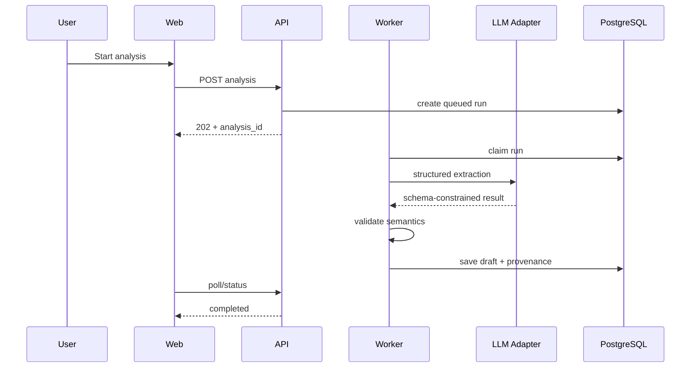
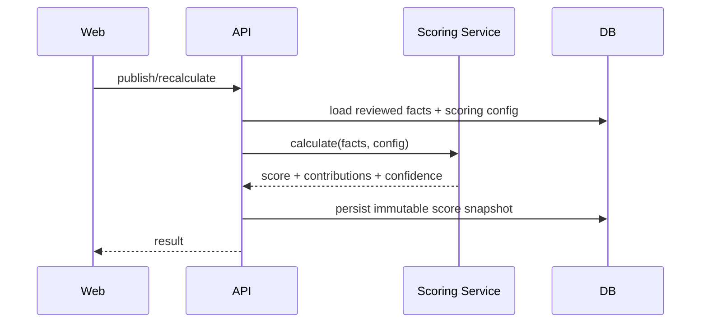

# Sequence Diagrams

## Analyze process

```mermaid
sequenceDiagram
  participant U as User
  participant W as Web
  participant A as API
  participant Q as Worker
  participant L as LLM Adapter
  participant D as PostgreSQL
  U->>W: Start analysis
  W->>A: POST analysis
  A->>D: create queued run
  A-->>W: 202 + analysis_id
  Q->>D: claim run
  Q->>L: structured extraction
  L-->>Q: schema-constrained result
  Q->>Q: validate semantics
  Q->>D: save draft + provenance
  W->>A: poll/status
  A-->>W: completed
```

## Score reviewed opportunity

```mermaid
sequenceDiagram
  participant W as Web
  participant A as API
  participant S as Scoring Service
  participant D as DB
  W->>A: publish/recalculate
  A->>D: load reviewed facts + scoring config
  A->>S: calculate(facts, config)
  S-->>A: score + contributions + confidence
  A->>D: persist immutable score snapshot
  A-->>W: result
```
