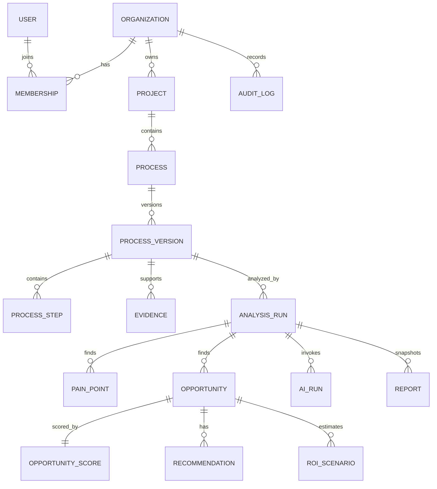

# ER Diagram

```mermaid
erDiagram
  ORGANIZATION ||--o{ MEMBERSHIP : has
  USER ||--o{ MEMBERSHIP : joins
  ORGANIZATION ||--o{ PROJECT : owns
  PROJECT ||--o{ PROCESS : contains
  PROCESS ||--o{ PROCESS_VERSION : versions
  PROCESS_VERSION ||--o{ PROCESS_STEP : contains
  PROCESS_VERSION ||--o{ EVIDENCE : supports
  PROCESS_VERSION ||--o{ ANALYSIS_RUN : analyzed_by
  ANALYSIS_RUN ||--o{ PAIN_POINT : finds
  ANALYSIS_RUN ||--o{ OPPORTUNITY : finds
  OPPORTUNITY ||--|| OPPORTUNITY_SCORE : scored_by
  OPPORTUNITY ||--o{ RECOMMENDATION : has
  OPPORTUNITY ||--o{ ROI_SCENARIO : estimates
  ANALYSIS_RUN ||--o{ AI_RUN : invokes
  ANALYSIS_RUN ||--o{ REPORT : snapshots
  ORGANIZATION ||--o{ AUDIT_LOG : records
```

All tenant-owned entities are scoped to Organization even when ownership is transitively obvious, enabling safer indexed queries and explicit authorization checks.
